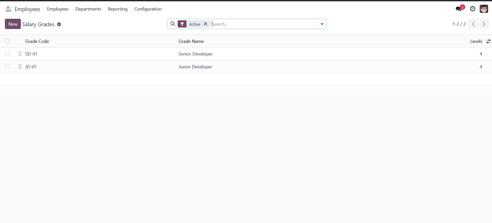
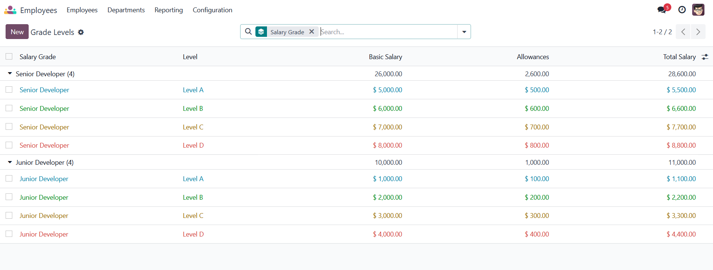

# HR Payroll Grade Structure

## Overview
This module enhances the HR Payroll system by introducing a structured salary grade and level management system for Odoo 17. It allows HR administrators to define salary grades, create multiple levels within each grade, and automatically apply these structures to employee contracts.

## Features

### Salary Grade Management
- Create and manage salary grades with unique codes
- Organize grades by sequence for easy sorting
- Archive/unarchive functionality

### Grade Level Management
- Define up to four levels (A/B/C/D) for each salary grade
- Set basic salary and allowances for each level
- Automatic total salary calculation

### Contract Integration
- Seamless integration with HR Contracts
- Automatic salary structure application
- Domain filtering for grade levels based on selected grade

## Installation
1. Copy this module to your Odoo addons directory
2. Update the apps list: Settings > Apps > Update Apps List
3. Search for "HR Payroll Grade Structure"
4. Click Install

## Configuration

### Setting Up Salary Grades
1. Navigate to **HR > Configuration > Payroll > Salary Grades**
2. Click **New** to create a salary grade
3. Enter a name and unique code for the grade
4. Add grade levels (A/B/C/D) with their respective salaries and allowances

### Applying to Contracts
1. Open an employee contract
2. Select a Salary Grade
3. Choose a Grade Level
4. Click "Apply Salary Structure" to auto-populate salary fields

## Usage

### Salary Grade Creation

*Figure 1: Accessing Salary Grades* 

*Figure 2: Viewing all Salary Grades*

*Figure 3: Creating a New Salary Grade*

### Grade Level Configuration

*Figure 4: Configuring Grade Levels* 

### Contract Integration

*Figure 5: Contract with Salary Grade Selection*

*Figure 6: Salary Structure Successfully Applied*

## Dependencies
- Odoo 17.0
- hr (Human Resources)
- hr_contract (Employee Contracts)

## Technical Information

### Models
- `salary.grade`: Manages salary grades
- `grade.level`: Handles grade levels and their configurations
- `hr.contract`: Extended with salary grade fields

### Security
Access rights are configured for different user roles:
- Employees: Read-only access
- HR Officers: Read, Write, Create
- HR Managers: Full access (Read, Write, Create, Delete)

## License
This module is licensed under LGPL-3.

## Author
Ahmed Maher Ali Ahmed AL-Maqtari

## Version
17.0.1.0.0
