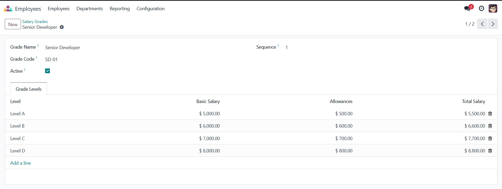
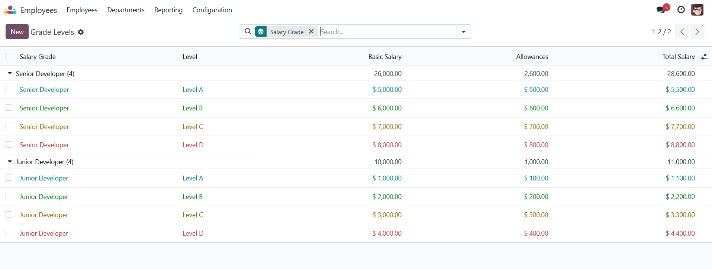
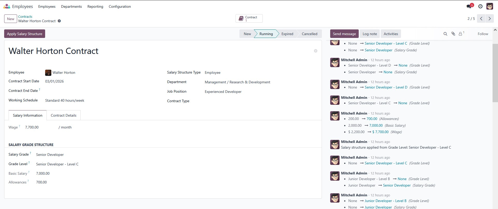

# HR Payroll Grade Structure

## Overview
This module provides a comprehensive salary grade and level management system for Odoo 17. It allows HR managers to define salary structures and automatically apply them to employee contracts.

## Features

### 1. Salary Grade Management
- Create and manage salary grades with unique codes
- Organize grades by sequence for easy sorting
- Archive/unarchive functionality

### 2. Grade Level Management
- Define four levels (A/B/C/D) for each salary grade
- Set basic salary and allowances for each level
- Automatic total salary calculation
- Color-coded display in tree view

### 3. HR Contract Integration
- Extend HR contracts with salary grade fields
- Automatic domain filtering for grade levels
- One-click "Apply Salary Structure" button
- Automatic wage calculation

### 4. Business Constraints
- **Unique Grade Codes**: Each salary grade must have a unique code
- **Unique Levels**: Prevents duplicate levels (A/B/C/D) within the same salary grade
- **Positive Values**: Basic salary and allowances cannot be negative
- **Grade-Level Validation**: Ensures selected grade level belongs to the selected salary grade

## Installation

1. Copy this module to your Odoo addons directory
2. Update the apps list: Settings > Apps > Update Apps List
3. Search for "HR Payroll Grade Structure"
4. Click Install

## Dependencies
- `base`
- `hr`
- `hr_contract`

## Usage

### Creating Salary Grades
1. Navigate to: HR > Configuration > Salary Grades > Salary Grades
2. Click "New"
3. Enter grade name and code
4. Add grade levels (A/B/C/D) with their respective salaries

*Figure 1: Salary Grades Menuitems*

*Figure 2: Salary Grades List View*

*Figure 3: Salary Grades Form View*

*Figure 4: Creating a New Salary Grade*

### Applying Salary Structure to Contracts
1. Open an employee contract
2. Select a Salary Grade
3. Select a Grade Level (filtered by the selected grade)
4. Click "Apply Salary Structure"
5. The basic salary, allowances, and wage will be automatically populated

*Figure 5: Salary Structure before applying*

*Figure 6: Salary Structure Successfully Applied to Contract*

## Technical Details

### Models
- `salary.grade`: Main model for salary grades
- `grade.level`: Model for grade levels (A/B/C/D)
- `hr.contract`: Extended with salary grade fields

### Security
Access rights are configured for:
- All Users: Read-only access
- HR Officers: Read, Write, Create
- HR Managers: Full access (Read, Write, Create, Delete)

## License
LGPL-3

## Author
Ahmed Maher Ali Ahmed AL-Maqtari

## Version
17.0.1.0.0